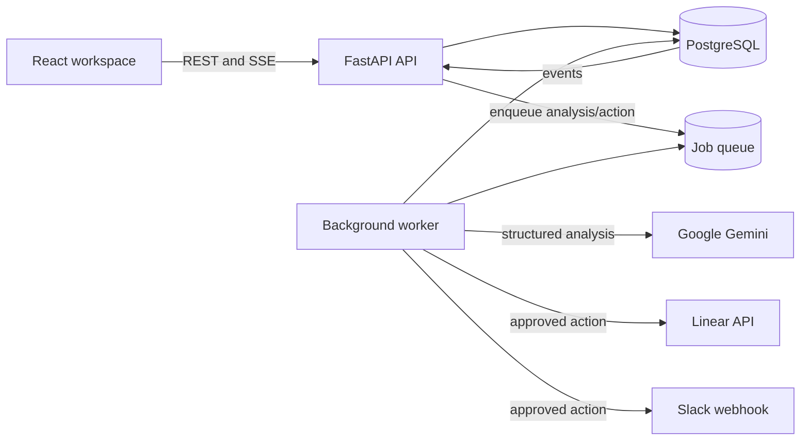

# Pilotree — AI Customer Enquiry Triage

A working take-home project for reviewing customer enquiries, enriching them with Gemini, and sending approved follow-up work to Linear or Slack.

## Live demo

**Application:** [pilotree-agent.onrender.com](https://pilotree-agent.onrender.com/enquiries)

**Demo access code:** `PilotreeDemo-2026!`

Render's free services may take about a minute to wake after inactivity. The application reconnects automatically once the API is ready.

### Suggested reviewer flow

1. Sign in with the demo access code.
2. Browse the imported enquiries and open one from the list.
3. Select **Analyse with AI** to generate a structured assessment from the original message.
4. Review or edit the summary, category, priority, suggested action, missing information, and risk flags.
5. Approve the analysis.
6. Create a Linear task. A Slack alert is also available as an additional integration.

The application never sends an enquiry automatically. Analysis approval and external delivery are separate user decisions.

## What it demonstrates

### 1. View enquiries

The React interface provides a searchable master-detail workspace for the supplied fictional customer enquiries. Users can filter by status, priority, category, and safety outcome, then open an individual enquiry without losing their place in the list.

### 2. Enrich an enquiry with AI

The backend sends the actual enquiry content to Google Gemini and requests a validated structured result containing:

- a concise summary;
- category and priority;
- a reason for the priority;
- a suggested next action;
- missing information;
- operational risk flags; and
- a recommended integration action when appropriate.

The result remains editable and requires human review. A safety layer detects personal information and suspicious instructions before the model output reaches the review step. Suspected prompt injection is displayed prominently and tool actions are withheld for that analysis.

### 3. Take an action

After approval, a reviewer can create a Linear task containing the enquiry context and approved analysis. Linear is the primary integration for the exercise. Slack is included as a second, fully working option for operational alerts.

Delivery runs through a durable outbox worker. The UI reports queued, sending, sent, failed, and uncertain outcomes and records each attempt, making retries visible instead of silently repeating an external action.

## Product decisions

- **Human approval before action:** AI assists with triage; a reviewer owns the final decision.
- **Grounded structured output:** Gemini must use the enquiry as its source and return a schema-validated result.
- **Safe handling of untrusted text:** prompt injection and sensitive-data screening happen before external actions are proposed.
- **One primary integration:** Linear is the clearest useful action for assigning and tracking enquiry follow-up. Slack is a small additional demonstration.
- **Write-only credentials:** configured destination secrets are redacted by the API and masked in Settings. Users can replace them without reading the stored value.

The prompts used during the meaningful parts of the build, along with what was kept and rejected, are documented in [AI_notes.docx](./AI_notes.docx).

## Technology

| Area | Choice |
| --- | --- |
| Frontend | React, TypeScript, Vite, TanStack Router and Query |
| Backend | Python 3.12, FastAPI, Pydantic, SQLAlchemy |
| Database | PostgreSQL |
| AI | Google Gemini with structured output |
| Workflow | LangGraph plus a PostgreSQL-backed job queue |
| Integrations | Linear and Slack |
| Live updates | Server-sent events with polling fallback |
| Deployment | Render static site, backend service with worker, and PostgreSQL |

## Architecture



The API persists the enquiry and queues analysis work. The worker runs the safety and LLM workflow, saves the result, and emits events for the UI. Once a human approves the analysis and explicitly selects a destination, the worker leases the outbox action, performs the external request, and records the attempt.

## Run locally

### Prerequisites

- Python 3.12+
- Node.js 20.19+ (22.12+ recommended)
- PostgreSQL 16+
- A Gemini API key

### Backend and database

```bash
docker compose up -d postgres

cd backend
uv venv
uv pip install -e '.[dev]'
cp ../.env.example .env
uv run alembic upgrade head
uv run uvicorn app.main:app --reload
```

Set `GEMINI_API_KEY` in `backend/.env` before running an analysis.

Start the background worker in a second terminal:

```bash
cd backend
uv run python -m app.jobs.worker
```

Import the supplied dataset if starting with an empty database:

```bash
cd backend
uv run python scripts/import_enquiries.py /path/to/customer-enquiries.json
```

### Frontend

```bash
cd frontend
npm ci
cp .env.example .env
npm run dev
```

For local testing without an OIDC provider, set `LOCAL_DEVELOPMENT_AUTH=true` and a random `LOCAL_DEVELOPMENT_SECRET` of at least 32 characters in `backend/.env`. Set `VITE_LOCAL_DEVELOPMENT_AUTH=true` in `frontend/.env`. The local-session endpoint only accepts loopback requests and approved local origins.

### Configure destinations

Sign in as the local administrator and open **Settings**. Enter a Slack incoming webhook or a Linear API key and team ID, then save. Stored secrets are returned only as a configured/masked state and can be replaced through **Reconfigure**.

## Validation

Run the backend suite:

```bash
cd backend
uv run pytest -q
```

Build and run the browser tests:

```bash
cd frontend
npm run build
npx playwright install chromium
npm run test:e2e
```

The automated suite covers the analysis workflow, safety decisions, review transitions, destination configuration, outbox leasing and recovery, action attempts, API behavior, and the main browser flows. External-service tests use controlled fakes and do not send real Slack messages or create real Linear tasks.

## Repository notes

- Environment files and credentials are excluded from Git.
- [`render.yaml`](./render.yaml) describes the deployed services and required environment settings.
- The OpenAPI schema used by the frontend is generated from FastAPI.
- The public demo uses fictional customer data supplied for this exercise.
